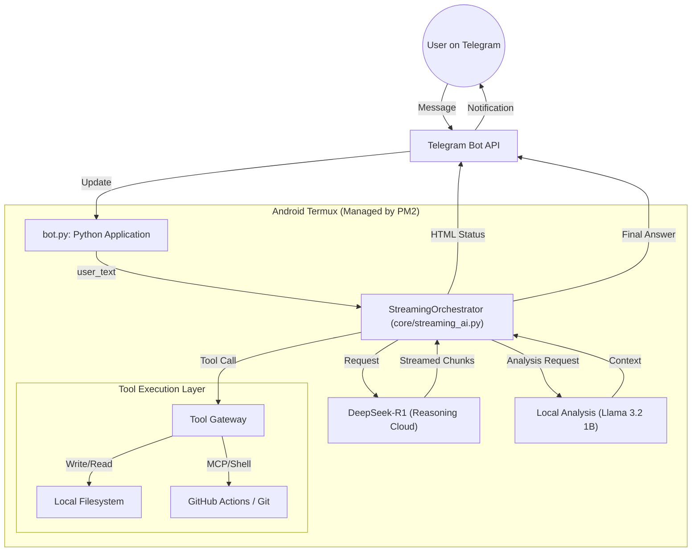
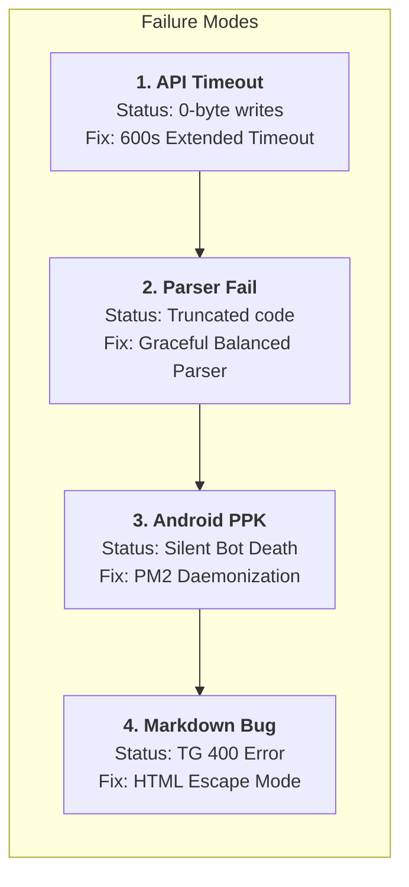

# OpenClaw Android: Comprehensive Architectural Blueprint

This document provides a visual and technical map of the OpenClaw bot system running on Android (Termux). It is designed to help you understand the data flow and identify where errors typically arise.

## 1. Overall System Architecture
This diagram shows how your messages travel through the different "organs" of the bot's brain.

## 2. Risk & Failure Points Map
This diagram highlights the 4 critical points where the bot used to "break" and how we fixed them.

## 3. Core Component Catalog

| File / Component | Responsibility | Intelligence Level |
| :--- | :--- | :--- |
| **`bot.py`** | Handles Telegram connectivity, polling, and HTML UI updates. | High (Interface) |
| **`streaming_ai.py`** | The "Maestro". Extracts tools from DeepSeek streams. | Max (Logic) |
| **`ollama_manager.py`**| Manages Llama 3.2 1B for heavy local code analysis. | Medium (Worker) |
| **`tools.py`** | Directly interacts with the Android filesystem. | Low (Worker) |
| **`mcp_manager.py`** | Bridges with GitHub and external servers. | Medium (Gateway) |
| **`memory.db`** | SQLite database storing all chat history. | Persistent (Storage) |

## 4. Troubleshooting Guide
When an error occurs, check this sequence:
1. **Connectivity**: Check `pm2 logs`. If `getUpdates` is 200, the network is OK.
2. **Brain**: If Bot is thinking but not writing, check the parser logic in `streaming_ai.py`.
3. **Storage**: Check `memory.db` for the last message ID to see if the bot "hallucinated" a success.

---
*Created by Antigravity AI Advisor - 2026-04-18*
